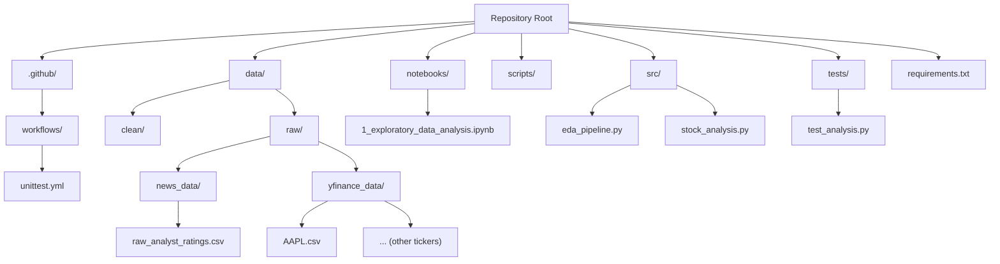
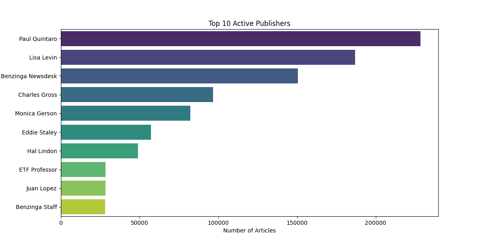

# 📰 Week 1 Challenge: Financial News Sentiment & Stock Prediction

### Project: Predicting Stock Price Moves with News Sentiment Analysis

This repository documents the foundational infrastructure and analysis for the 10 Academy Financial News Sentiment challenge. The objective is to merge financial news data with technical stock indicators to analyze potential correlations.

---

## 🚀 Project Status and Deliverables (Interim Report)

| Component | Status | Deliverable |
|----------|--------|-------------|
| **Task 1: Infrastructure** | ✅ COMPLETE | Full Git/GitHub workflow, clear structure, and CI/CD pipeline. |
| **Task 2: Quantitative Prep** | ✅ COMPLETE | Technical indicators (RSI, MACD, SMA) calculated using TA-Lib. |
| **Interim Report** | ✅ COMPLETE | Report submitted detailing initial findings and methodology. |
| **Next Phase** | 🔄 In Progress | Sentiment Scoring & Correlation Testing (Task 3). |

---

## 🛠️ Project Structure and Infrastructure




### **Continuous Integration (CI/CD)**

A robust CI pipeline using **GitHub Actions** is active. Any code push triggers `pytest` to ensure all core modules are functional and stable.

---

## 📊 Key Initial Findings (Task 1 EDA)

| Finding | Detail |
| :--- | :--- |
| **Headline Density** | Average headline length is approximately **75 characters**. The distribution is **right-skewed**, confirming concise text concentration. |
| **Publisher Dominance** | The top three most active publishers are **Paul Quintaro**, **Lisa Levin**, and **Benzinga Newsdesk**. |

### **Visualization Example**



# 💡 Key Technical Challenge (Focus for Task 3)

The most significant hurdle in this project is the **time zone and date alignment** between:

- **News timestamps** (UTC or local time zones)
- **Stock market trading data** (EST/EDT trading sessions)

The next phase will implement **precise time normalization**, ensuring that:

- News released **after market close** is shifted to the **next trading day**  
- All timestamps align with **actual market sessions**  
- **Data leakage is avoided** by preventing future information from entering past labels  
## 💻 How to Run the Project

### 1️⃣ Clone the Repository

```bash
git clone https://github.com/Yodahe2021/Week1-Financial-News-Sentiment.git
cd Week1-Financial-News-Sentiment
```
### 2️⃣ Set Up the Python Environment

```bash
python -m venv venv
source venv/bin/activate   # On Windows: venv\Scripts\activate
pip install -r requirements.txt
```
### 3️⃣ Run the Analysis

```bash
jupyter notebook
```

